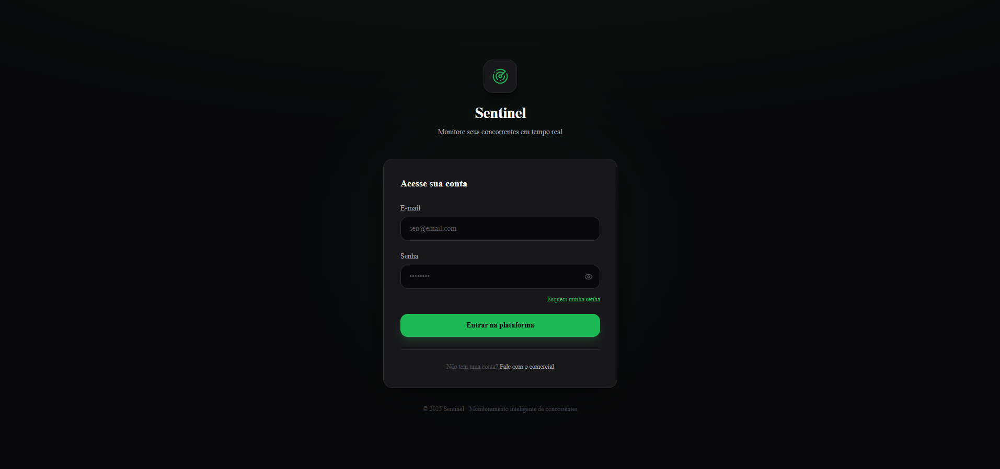
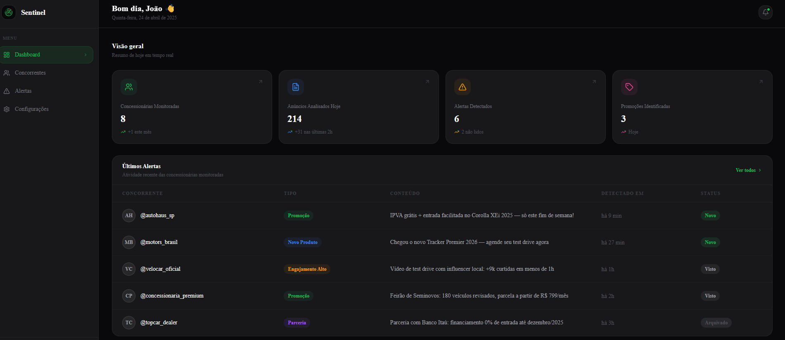

# 🛡️ Sentinel

### Monitoramento inteligente de concorrentes no Instagram

[](https://monitor-concorrentes-puce.vercel.app)

---

## Sobre o Projeto

O **Sentinel** é uma plataforma de monitoramento de concorrentes no Instagram voltada para negócios que precisam acompanhar a movimentação da concorrência em tempo real — sem perder tempo navegando manualmente pelas redes sociais.

**Problema que resolve:** acompanhar o que os concorrentes estão publicando (promoções, lançamentos, parcerias, posts virais) exige tempo e atenção constante. O Sentinel centraliza esses alertas em um único painel, notificando automaticamente quando algo relevante acontece.

**Para quem é:** empresas e profissionais de marketing que precisam de inteligência competitiva no Instagram — concessionárias, e-commerces, franquias, agências e qualquer negócio onde monitorar a concorrência é parte da estratégia.

---

## Funcionalidades

- **Dashboard** — visão geral com métricas em tempo real: concorrentes monitorados, anúncios analisados no dia, alertas detectados e promoções identificadas. Tabela com os alertas mais recentes de cada perfil monitorado.

- **Concorrentes** — gerenciamento dos perfis monitorados. Adicione, pause ou remova concorrentes. Visualize seguidores, volume de posts analisados e horário do último alerta de cada perfil.

- **Central de Alertas** — todos os alertas organizados em cards, filtráveis por tipo: Promoções, Novos Produtos, Engajamento Alto e Parcerias. Clique no card para marcar como lido.

- **Configurações** — gerencie sua conta, ative ou desative canais de notificação (WhatsApp e e-mail), escolha quais tipos de alerta receber e veja o status das integrações conectadas.

---

## Stack Utilizada

| Tecnologia | Uso |
|---|---|
| [Next.js 16](https://nextjs.org) | Framework React com App Router |
| [Tailwind CSS 4](https://tailwindcss.com) | Estilização utilitária |
| [shadcn/ui](https://ui.shadcn.com) | Componentes de interface |
| [Lucide React](https://lucide.dev) | Biblioteca de ícones |
| [TypeScript](https://www.typescriptlang.org) | Tipagem estática |
| [Vercel](https://vercel.com) | Deploy e hospedagem |

---

## Screenshots




```

```

```

```

---

## Acesse o Projeto

🔗 **[monitor-concorrentes-puce.vercel.app](https://monitor-concorrentes-puce.vercel.app)**

---

## Autor

Desenvolvido por **João Borba** como projeto de portfólio.

[](https://linkedin.com/in/ojoaoborba)
[](https://github.com/ojoaoborba)
